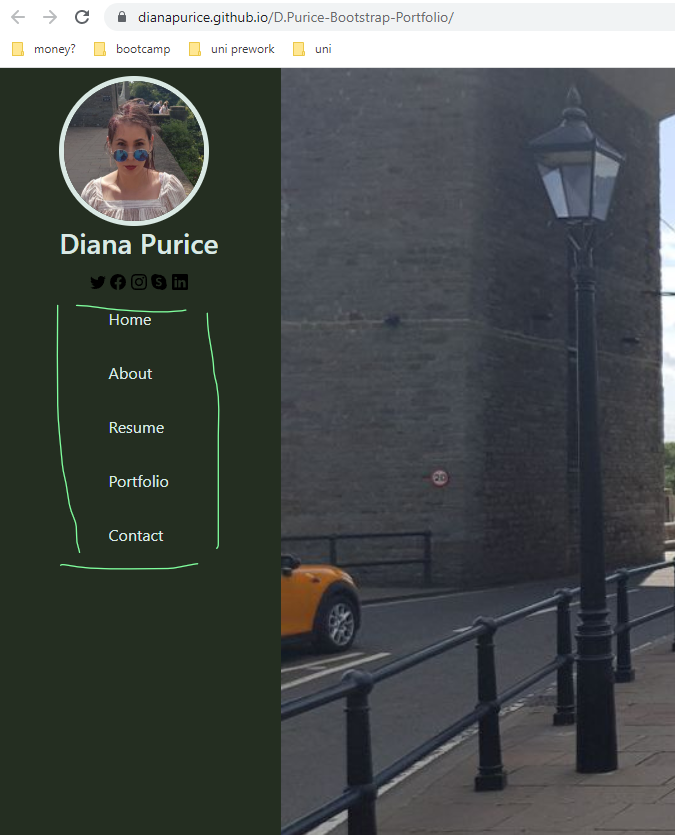
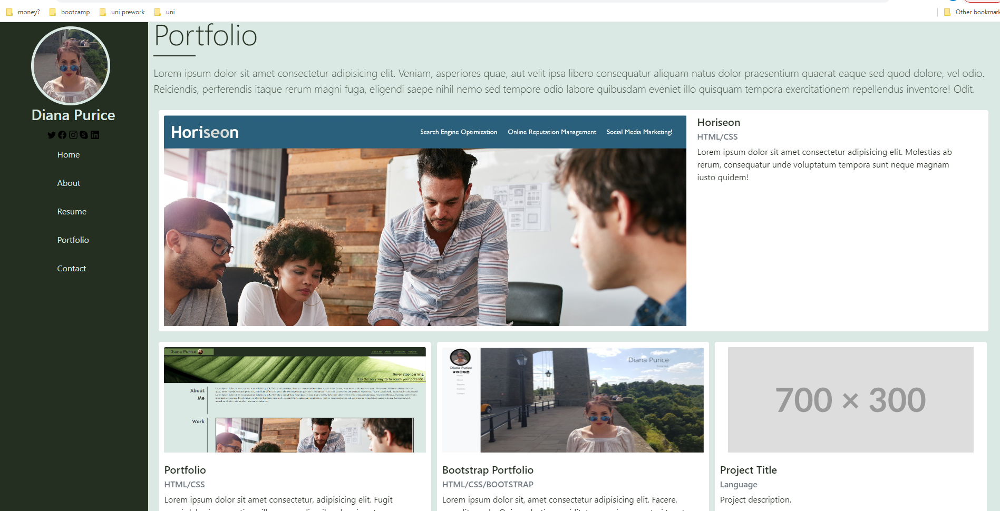
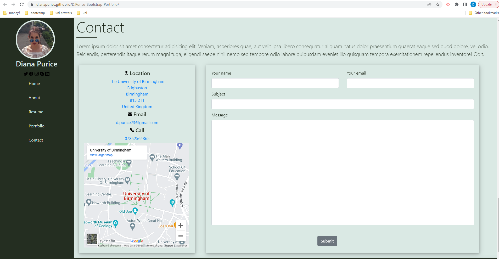
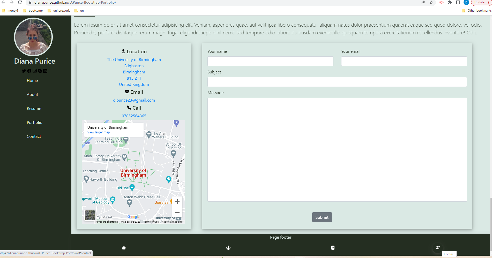

# D.Purice-Bootstrap-Portfolio

## Description

I have built this website using the bootstrap framework to showcasts my current projects, skilld and contact information.

## Installation

No installation required.
Can be accessed at: https://dianapurice.github.io/D.Purice-Bootstrap-Portfolio/

## Usage

View when the website is accessed.

Use the links in the navigation bar to access the page sections or my resume.

Use the links in the navigation bar to access my social media pages.

Use the GitHub link in the about section to access my GitHub page.

Access my applications by clicking on the page picture.

Find and contact me via the Contact section.

Use the links in the footer to navigate through the page.

## Credits

Not applicable.

## License

Please refer to the LICENCE in the repo.